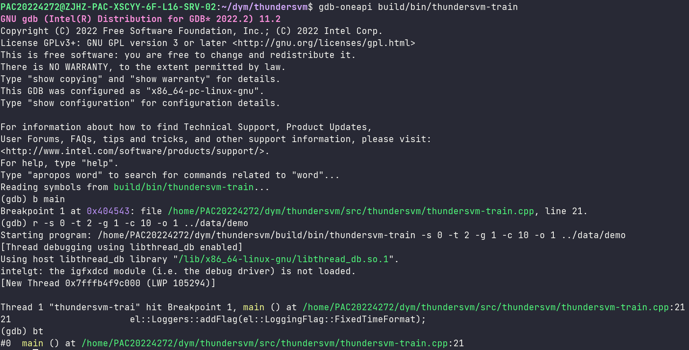
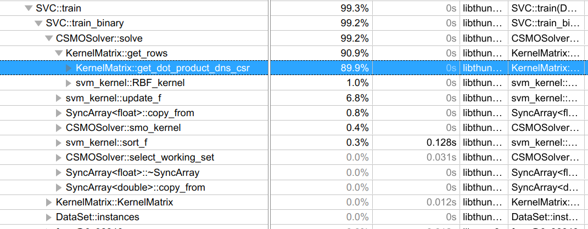
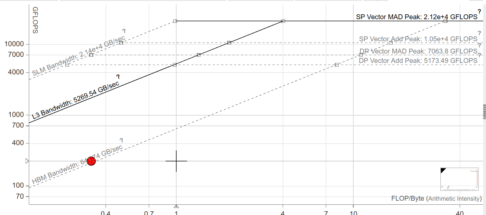

# oneapi-guide

## dpcpp & Queue & Shared Local Memory

一个`sycl::queue`可以绑定一个设备，这里的设备可以是CPU、GPU或FPGA等。对于GPU来说，一般情况下GPU还会分为多个sub deivce，每个sub device对应一个GPU中的Tile。下面是一个获取sub device的例子：

```cpp
auto platforms = sycl::platform::get_platforms();
sycl::device gpus[2];
for (auto &platform : platforms) {
    if (platform.get_info<sycl::info::platform::name>() == "Intel(R) Level-Zero") {
        auto devices = platform.get_devices();
        for (size_t i = 0; i < 2; ++i) {
            gpus[i] = devices[i];
        }
    }
}
auto gpu0_sub_devices = gpus[0].create_sub_devices<cl::sycl::info::partition_property::partition_by_affinity_domain>(cl::sycl::info::partition_affinity_domain::next_partitionable);
auto gpu1_sub_devices = gpus[1].create_sub_devices<cl::sycl::info::partition_property::partition_by_affinity_domain>(cl::sycl::info::partition_affinity_domain::next_partitionable);

auto m_q0 = sycl::queue(gpu0_sub_devices[0]);
auto m_q1 = sycl::queue(gpu0_sub_devices[1]);
auto m_q2 = sycl::queue(gpu1_sub_devices[0]);
auto m_q3 = sycl::queue(gpu1_sub_devices[1]);
```

`dpcpp` 的一般代码结构为：

```cpp
q.parallel_for(sycl::range<1>(n_instances), [=](sycl::id<1> idx) {
    double sum_diff = 0;
    for (int i = 0; i < alpha_size; ++i) {
        float_type d = alpha_diff[i];
        if (d != 0) {
            sum_diff += d * k_mat_rows[i * n_instances + idx];
        }
    }
    f[idx] -= sum_diff;
}).wait();
```

其中，`parallel_for` 为异步地开启一个kernel，如果想要让kernel同步执行，则需要在最后加上`.wait()`的调用。但是我们一般会使用`submit`方法提交队列，因为`submit`可以用到`sycl::stream`或Shared Local Memory 等功能。例子如下：

```cpp
sycl::range<2> global_range(pad_m, pad_n), local_range(bm, bn);
q.submit([&](sycl::handler& h) {
    sycl::accessor<kernel_type, 1, sycl::access::mode::read_write, sycl::access::target::local> sa(sycl::range(bm * bk), h);
    sycl::accessor<kernel_type, 1, sycl::access::mode::read_write, sycl::access::target::local> sb(sycl::range(bk * bn), h);
    sycl::stream out(65536, 256*5, h);
    h.parallel_for(sycl::nd_range<2>(global_range, local_range), [=](sycl::nd_item<2> it) [[intel::reqd_sub_group_size(16)]] {
        size_t i = it.get_global_id(0);
        size_t j = it.get_global_id(1);
        auto group = it.get_group();
        size_t ti = it.get_local_id(0);
        size_t tj = it.get_local_id(1);

        kernel_type sum = 0;
        for (size_t ki = 0; ki < pad_k; ki += bk) {
            sa[ti*bk + tj] = A[i*pad_k + ki + tj];
            sb[ti*bn + tj] = B[(ki+ti)*pad_n + j];
            it.barrier(sycl::access::fence_space::local_space);
            for (size_t inner_k_count = 0; inner_k_count < bk; inner_k_count++) {
                sum += sa[ti * bk + inner_k_count] * sb[inner_k_count * bn + tj];
            }
            it.barrier(sycl::access::fence_space::local_space);
        }
        C[i * pad_n + j] = sum;
    });
}).wait();
```

其中的`global_range`与`local_range`分别代表总的迭代次数与一个work group的大小，这些range的维度可以指定成一维、二维或三维。work group中的元素称为work item，或称为线程。

对于Shared Local Memory，一般我们会用`sycl::accessor`来定义Shared Local Memory实例。一个work group内共享同一个Shared Local Memory实例。不同线程同时向共享数组写入值时，有的线程写得快，有的线程写得慢。所以我们需要同步整个work group中的线程，方法为使用：`it.barrier(sycl::access::fence_space::local_space);`

## mkl

OneAPI提供了mkl的实现，官方文档详细地介绍了API的调用方法，比如这是一个[GEMM的文档](https://oneapi-src.github.io/oneMKL/domains/blas/gemm.html)。

需要注意的是，MKL中的SpMM、GEMM、SpMV的`ld{a,b,c}`比较独特，所以要严格按文档的描述来写。下面是一个SpMM的例子：

```cpp
mkl::sparse::matrix_handle_t handle;
mkl::sparse::init_matrix_handle(&handle);
mkl::sparse::set_csr_data(handle, m, k, mkl::index_base::zero, row_ptr_usm, col_ptr_usm, val_usm);
// sizes:
// A = m * k
// B = n * k
// C = n * m
mkl::sparse::gemm(q, mkl::layout::row_major, mkl::transpose::nontrans,
                  mkl::transpose::nontrans, 1, handle, dense_trans, n,
                  n, 0, res, n);
q.wait();
```

需要特别注意的是，mkl内部没有自动wait，所以在计算完后要根据自身需要来显示调用`wait()`。

要使用mkl，只要包含头文件`#include <oneapi/mkl.hpp>` ，同时在编译选项中加上`-qmkl`，否则会出现链接错误。

## 错误调试：sycl::stream 与 gdb-oneapi

调试GPU代码比较困难，但对于一般的代码来说，直接打印是一个比较好用的方法。oneapi提供了输出流`sycl::stream`。该对象的行为与C++标准库的流非常相似，可以直接把用`std::cout`的经验迁移过来。同时要注意的是，`sycl::strema`的缓冲区大小有限，在选择输出结果前需要仔细考虑到底要输出哪些内容。一般来说我们会只允许某些线程单独进行输出。

在程序发生段错误后，我们会使用`gdb-oneapi`来定位错误位置。`gdb-oneapi`的使用方法和`gdb`几乎完全一样。在编译时加上`-g`参数后，就可以用`gdb-oneapi <executable file>`来调试了，常用的几个调试命令为：使用`r <main function arguments>`来开启程序，使用`bt`查看当前调用栈信息等。 比如：



## Vtune 与 Advisor

`vtune` 可以查看程序的热点代码，同时也可以查看各个函数的开始执行时间、结束执行时间等等，是非常有用的辅助工具。对于没有图形界面的服务器，我们一般的做法是先在服务器上生成报告，然后将报告下载到本地，最后使用本地的vtune查看报告。比如这是一个生成热点代码的命令：

```
vtune -collect hotspots -knob sampling-mode=sw -- ./myApplication
```

生成的报告样例如下：



同样我们也可以用`advisor`查看程序的roofline，命令为：

```
advisor --collect=roofline --profile-gpu --project-dir=./advi_results -- ./myApplication
```

这是一个样例：


